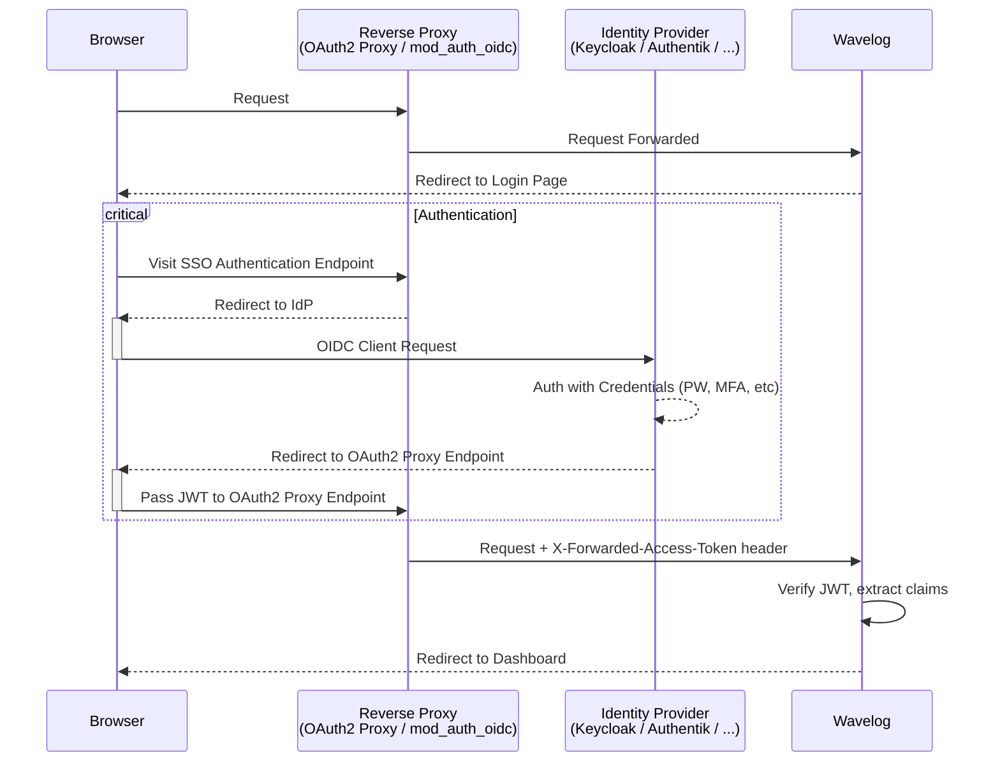

# Third-Party Authentication

Wavelog supports authentication via third-party identity providers (IdPs) using the OpenID Connect (OIDC) protocol. Instead of managing usernames and passwords itself, Wavelog delegates authentication to a trusted reverse proxy that sits in front of it. The reverse proxy verifies the user's identity with the IdP and forwards a signed JWT access token to Wavelog via an HTTP header. Wavelog requires that each username is unique across all IdPs that provide authentication. Wavelog will error if usernames class across JWT issuers.

!!! info "Wavelog Support Scope"
    While Wavelog supports OIDC and gives some guidance about SSO and its configuration with this documentation, we don't support you directly with your Identity Provider. So if you don't know how to set up Keycloak, adding 2-factor in Authentik or how the internet works, we unfortunately can't help you with that. You will find great forums and support communities for these topics. Thanks for your understanding.

## How It Works



Wavelog reads the JWT from the configured header, verifies it (optionally against the IdP's JWKS endpoint), extracts the user's identity from the claims and logs them in. On first login, a local Wavelog account can be created automatically.

## Prerequisites

- A reverse proxy that forwards a JWT access token to Wavelog via an HTTP header (e.g. <a href="https://oauth2-proxy.github.io/oauth2-proxy/" target="_blank">OAuth2 Proxy</a>, Apache `mod_auth_oidc`)
- An identity provider that supports OIDC (e.g. Keycloak, Authentik, Zitadel)
- The IdP must include at least **username**, **email** and a **callsign** claim in the JWT

## Proxy Scope

!!! warning "Important"
    Only the SSO login endpoint `/index.php/header_auth/login` needs to be protected by the reverse proxy. All other Wavelog endpoints (the app itself, the API, the login page) must remain directly accessible — otherwise the some features, API integrations and the SSO redirect back to Wavelog will break.

Configure your reverse proxy to require authentication **only** for that single path and pass through everything else unauthenticated. Wavelog will manage everything else.

## Quick Setup

**Step 1:** Enable SSO in `application/config/config.php`:

```php
<?php
$config['auth_header_enable'] = true;
```

**Step 2:** Copy `sso.sample.php` to `sso.php` in the same directory and adjust the values:

```bash
cp application/config/sso.sample.php application/config/sso.php
```

**Step 3:** Configure your identity provider and reverse proxy. See the provider-specific guides:

- [Keycloak](keycloak-configuration-guide.md)
- [Authentik](authentik-configuration-guide.md)
- more to come...

!!! tip "Already running Apache2?"
    If Apache2 is your webserver, use [`mod_auth_openidc`](apache2-mod-auth-openidc.md) instead of OAuth2 Proxy. It handles the full OIDC flow natively — no additional container or proxy needed. This is the recommended approach for Apache2 setups.

### Some words about other solutions

#### Login via Google, GitHub or similar public IdPs

Using Google, GitHub, or similar public identity providers as a direct IdP for Wavelog is technically possible — oauth2-proxy has built-in support for both — but comes with a fundamental limitation: **these providers do not support custom user attributes in their tokens**. Wavelog requires a callsign claim in the JWT, and there is no standard way to include one with a regular Google or GitHub account.

The recommended approach is to use Google or GitHub as a **social login source within Authentik or Keycloak**. The user authenticates with Google/GitHub, your IdP enriches the token with a callsign attribute you manage, and Wavelog receives a proper JWT with all required claims. This gives you the convenience of social login without sacrificing control over the token contents.

---

## Configuration Reference

All SSO settings live in `application/config/sso.php`. This file is only loaded when `auth_header_enable` is `true` in `config.php`.

For detailed explanations of each option, see the inline comments in `sso.sample.php` or your copied `sso.php`.

---

## JWT Signature Verification

Wavelog supports two modes of JWT verification:

### JWKS Mode (strongly recommended)

When `auth_header_jwks_uri` is configured, Wavelog fetches the IdP's public keys and uses them to cryptographically verify the JWT signature using <a href="https://github.com/firebase/php-jwt" target="_blank">Firebase JWT library</a>. This also validates `exp` (expiry), `nbf` (not before) and the signing algorithm.

### Low-Security Mode

When `auth_header_jwks_uri` is empty, the JWT payload is decoded without signature verification. Wavelog still checks `exp`, `nbf`, `iat`, `typ` and that the algorithm is in a list of common algorithms (`none` is not allowed).

!!! warning
    Low-Security mode provides no cryptographic guarantee that the token was issued by your IdP. Only use this if your reverse proxy is fully trusted and the forwarded header cannot be spoofed (e.g. the proxy strips any incoming headers with the same name before forwarding its own). If you don't know what this means, use JWKS mode and ensure your reverse proxy is configured correctly.

---

## Claim Mapping

### Required Claims

The `auth_headers_claim_config` option maps Wavelog user fields to JWT claim names. The keys are column names in the `users` database table. You can basically map any user field from the JWT claims, but the following are required for automatic account creation:

- `user_name` (maps to the JWT claim containing the username)
- `user_email` (maps to the JWT claim containing the email address)
- `user_callsign` (maps to the JWT claim containing the callsign)

#### Not allowed to override

- `id` (user ID in Wavelog)
- `external_account` (the JSON field storing the IdP issuer and subject)
- `password` (SSO users still can have a local password for direct login if `auth_header_allow_direct_login` is `true`, but it can't be mapped from the JWT)
- `user_type` (It's not possible to create admin accounts via SSO, so this is always set to "operator" for SSO users)

```php
<?php
$config['auth_headers_claim_config'] = [
    'user_name' => [
        'claim'               => 'preferred_username',
        'override_on_update'  => true,
        'allow_manual_change' => false,
    ],
    'user_email' => [
        'claim'               => 'email',
        'override_on_update'  => true,
        'allow_manual_change' => false,
    ],
    'user_callsign' => [
        'claim'               => 'callsign',
        'override_on_update'  => true,
        'allow_manual_change' => false,
    ],
    // ... additional fields
];
```

### Options per field

| Option | Description |
|--------|-------------|
| `claim` | The JWT claim name to read the value from |
| `override_on_update` | If `true`, the field is updated from the JWT on every login. If `false`, the value is only written once when the account is created |
| `allow_manual_change` | If `true`, the user can edit this field in their Wavelog profile. If `false`, the field is read-only and displays an **IdP** badge |

### Custom fields

You can map any additional column from the `users` table. Fields not listed use their default values on account creation and are not updated on subsequent logins.

---

## Group Mapping

Users can be mapped to existing clubstations as club members. This requires `$config['special_callsign'] = true;`.

$config['auth_header_clubstation_claim'] should be set to the JWT claim that  provides a multi-valued group attribute (RFC7643 4.1.2). The common claim  is "groups" per RFC9068 2.2.3.1.
There are two methods to map JWT / OIDC groups to clubstations:

1. Directly, each group matches to one clubstation ID
2. Dynamically, a prefix for all OIDC groups that have clubstation ID

### Direct Group Mapping

This uses `$config['auth_header_clubstation_direct']`, each key is a JWT issuer. If set to empty string it applies to all JWT issuers. Below
each issuer the keys are:

- group: The name of the group defined in the IdP
- update_on_login: If user membership should be updated on each login. If false user is only assigned on user creation. (Recommended value is true)

```php
$config['auth_header_clubstation_direct'] = [
    "https://idp.example.com/realms/acme" => [
        9 => [
            'group' => 'wl_society_station_group',
            'update_on_login' => true
        ],
        15 => [
            'group' => 'wl_special_event_station',
            'update_on_login' => true
        ],
    ]
];
```

### Dynamic Group Mapping

Each key is a JWT issuer. If set to empty string it applies to all JWT issuers. Below
each issuer the keys are group prefixes and the value is if user membership should be updated on each login. 
If false user is only assigned on user creation. If true users are added to clubstations on login. (Recommended value is true)

!!! warning
    Dynamic Group Mapping does not remove users from Clubstations when they are removed from the IdP group

This uses `$config['auth_header_clubstation_dynamic']`:

```php
$config['auth_header_clubstation_dynamic'] = [
    "https://idp.example.com/realms/acme" => [
        'wavelog_' => true
    ]
];
```

## User Identification

Wavelog identifies SSO users by a composite key consisting of the JWT `iss` (issuer URL) and `sub` (subject) claims, stored as JSON in the `external_account` database column:

```json
{"iss":"https://auth.example.org/realms/example","sub":"c267892a-2815-4ee7-85ad-c1257ade2b65"}
```

This uniquely identifies a user across IdP and user, independent of username or email changes. We decided to store this information in plain JSON in the `external_account` column to allow admins to move an IdP to a new URL or link an existing account to an SSO account by manually updating the database. See next section for details.

### Migrating after an IdP URL change

If the URL of your identity provider changes (e.g. you move Keycloak to a new domain), the `iss` value in all existing `external_account` entries must be updated. The `sub` value (user UUID in Keycloak) stays the same.

Run the following SQL on your Wavelog database to modify the issuer URL in place for all existing accounts:

```sql
UPDATE users
SET external_account = JSON_SET(
    external_account,
    '$.iss',
    'https://auth.new-domain.org/realms/example'
)
WHERE external_account IS NOT NULL;
```

If you have more then one IdP or realm, you can add an additional condition to the `WHERE` clause to only update the affected accounts:

```sql
WHERE JSON_VALUE(external_account, '$.iss') = 'https://auth.old-domain.org/realms/example'
```

!!! note
    Verify the replacement with a `SELECT` first before running the `UPDATE`.

---

## User Profile Behavior

The visibility of the password field in the user profile depends on the SSO configuration:

| `auth_header_enable` | `allow_direct_login` | Has SSO account | `hide_password_field` | Password field visible? |
|---|---|---|---|---|
| `false` | — | — | — | Always |
| `true` | `false` | — | — | Never |
| `true` | `true` | No | — | Yes |
| `true` | `true` | Yes | `false` | Yes |
| `true` | `true` | Yes | `true` | No |

Fields with `allow_manual_change: false` in the claim map are shown as read-only with an **IdP** badge in the user profile, indicating they are managed by the identity provider.

---

## Troubleshooting

### Enable debug logging

Set the following in `sso.php` and `config.php`:

```php
<?php
// sso.php
$config['auth_header_debug_jwt'] = true;

// config.php
$config['log_threshold'] = 2; // debug
```

On the next login attempt, the raw JWT and the decoded claims are written to `application/logs/log-YYYY-MM-DD.php`. Use this to verify that the correct claims are being forwarded and to find the exact claim names for `auth_headers_claim_config`.

!!! warning
    Remember to disable `auth_header_debug_jwt` after troubleshooting.

### Common issues

**SSO button not appearing on the login page**
: Check that `auth_header_enable = true` in `config.php` and that `sso.php` exists in `application/config/`.

**"User not found" error**
: The JWT does not contain an `iss` or `sub` claim, or the token failed verification. Enable debug logging to inspect the token.

**User created but wrong callsign / email**
: The claim names in `auth_headers_claim_config` do not match the actual claims in the JWT. Enable debug logging to see all available claims.

**Token verification failed**
: Check that `auth_header_jwks_uri` points to the correct JWKS endpoint of your IdP and that the Wavelog server can reach it over the network.

**Email already exists error on login**
: A local Wavelog account with the same email address already exists. Link the existing account manually by setting its `external_account` column in the database to the correct `{"iss":"...","sub":"..."}` value.
