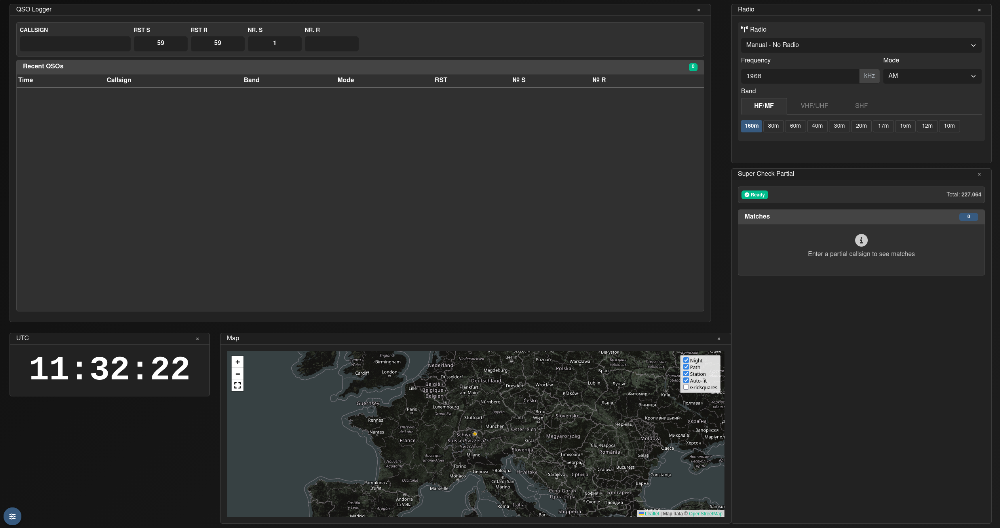

# Contesting

Wavelog has had a contest logger since day one. Over the years, however, it became increasingly apparent that the original implementation by LA8AJA, dating back to the Cloudlog era, served its purpose well but was no longer compatible with several important features introduced during Wavelog's ongoing development (most notably: club stations). As a result, the contesting module was completely rethought and redeveloped over several months. The outcome is a modern, flexible, and powerful contest engine that integrates seamlessly into Wavelog and is suitable for both single-operator and multi-operator stations. The new contest engine was released in Wavelog 3.0.0.

