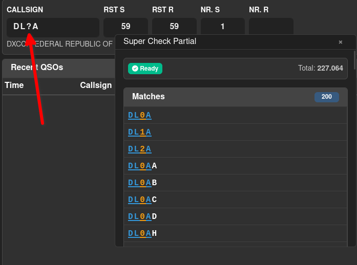
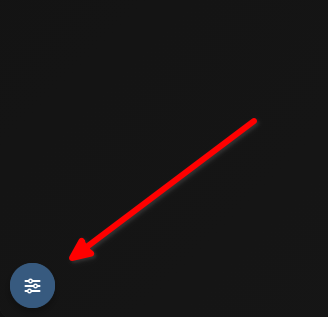

# Contest Logging Engine

The Contest Logging Engine opens when you click the **START** button on a contest session in the [Contest Manager](management.md). It provides a full-screen workspace optimised for fast QSO entry during a contest.

## Workspace Layout

The engine uses a free-form, window-based layout. Each component is an independent, movable and resizable panel — drag the title bar to move it, drag the edges or corners to resize. Components can be layered on top of each other or arranged freely to suit your screen and operating style.

The default layout on first open places the components as follows:

- **QSO Logger** — large panel, top-left
- **Radio** — top-right
- **Super Check Partial** — right column, below Radio
- **UTC Clock** — bottom-left
- **Map** — bottom-centre

## Components

### QSO Logger

The main entry form and QSO list in one panel.

**Entry form fields:**

| Field | Description |
|-------|-------------|
| **Callsign** | The callsign of the station worked. DXCC and callbook lookup triggers automatically as you type. |
| **RST S / RST R** | Signal report sent and received. Pre-filled with 59. These fields are skipped when pressing Tab. |
| **Nr. S / Nr. R** | Serial number sent and received. Visible only when the session has the Serial Number exchange field enabled. Nr. S is auto-incremented. |
| **Grid S / Grid R** | Grid square sent and received. Visible only when the session has the Grid Square exchange field enabled. |
| **Exch S / Exch R** | Free-text exchange sent and received. Visible only when the session has the Exchange (text) field enabled. |

The Tab key moves focus through the **active exchange fields only**, in the order configured in the session setup. RST fields are excluded from the Tab order.

Press **Enter** on the last field to save the QSO.

**DXCC and callbook info:**

While you type a callsign, Wavelog looks up the DXCC entity and — if callbook lookup is enabled for the session — name, QTH, and grid square from the callbook. The results appear as a small info line below the entry form. This lookup is cached server-side for 4 hours.

**Worked-before warning:**

If the callsign was already logged in this session, a red badge appears below the callsign field showing the time of the previous QSO. The QSO can still be saved; the warning is informational only.

**Recent QSOs list:**

Below the entry form, a scrollable table shows all QSOs logged in the session, most recent first. In a club station, an Operator column shows which operator logged each QSO.

Each row has two action buttons:

- **Edit** (pencil) — opens an inline edit mode for that row. You can change callsign, mode, frequency, time, RST, serial numbers, exchange values, and grid square. Only the operator who logged the QSO can edit it. Edit mode can also be started by double-clicking the row. Press Enter to save changes or Escape to cancel and restore the original values.
- **Delete** (trash) — removes the QSO from the session and from the main logbook. A confirmation prompt is shown. Only the operator who logged the QSO can delete it.

### Radio

Displays the current frequency and mode and lets you select the band. Three source options are available in the dropdown:

- **Manual — No Radio** — enter frequency and mode directly. Band can be selected using the band buttons.
- **WebSocket (Real-time)** — reads frequency and mode from the Wavelog Worker via WebSocket. Provides instant updates without polling.
- **CAT radio** — any radio configured in your station profile. Frequency and mode are polled on each heartbeat. The status line shows how many minutes ago the data was last updated.

Bands are grouped into tabs: **HF/MF**, **VHF/UHF**, and **SHF**. Clicking a band button sets the frequency to the band's default (by mode) and updates the active band. The frequency display uses your configured unit (kHz or MHz) per band.

### Super Check Partial (SCP)

Matches the callsign you are currently typing against the scp source of Wavelog which are cached in your browser. Matches are listed as you type. Click a match to copy it to the callsign field.

You can also enter `?` in the callsign field for wildcard search. For example, `DL?A` matches any callsign starting with DL and ending with A, such as DL1A or DL8A.

The status bar shows the loading state and the total number of entries in the loaded database.

### Map

An interactive Leaflet map that plots each worked station as a marker. The great-circle path to the most recently logged station is drawn as a line.

Toolbar overlays toggle additional layers:

| Toggle | Effect |
|--------|--------|
| **Night** | Day/night terminator shadow |
| **Path** | Great-circle path line to the last QSO |
| **Station** | Your own station marker |
| **Auto-fit** | Automatically zooms to fit all QSOs after each new entry |
| **Gridsquares** | Maidenhead grid square overlay |

Map preferences are saved per user and persist across sessions. Gridsquare overlay is disabled by default as it needs more ressources to render.

### UTC Clock

Shows the current UTC time, updated every second.

### Winkeyer

Appears automatically when the Winkeyer integration is enabled in your Wavelog settings. Provides CW keying directly from the logging engine:

- **F1–F10** — function keys that send pre-programmed CW messages
- **CW Speed** — WPM setting, adjustable live
- **Stop** — interrupts transmission immediately
- **Tune** — sends a continuous carrier for antenna tuning
- **Text input** — type arbitrary text and send it via the **Send** button

The Winkeyer component reads the callsign, RST, serial, exchange, and grid fields directly from the QSO entry form.

## Control Panel

Click the slider icon (top-left of the workspace) to open the Control Panel sidebar. It slides in from the left by default; you can change the side in the Settings section at the bottom.

### Components

A toggle button for each component lets you hide or show it without losing its position and size.

### User Layouts

Save your current window arrangement as a named layout. Saved layouts appear as a list from which you can load or delete them. One layout can be marked as the **default** — it is automatically applied every time you open the logging engine (independent of the contest session!)

- **Save New Layout** — prompts for a name and saves the current window positions and sizes
- **Reset to Default Layout** — discards any manual moves and reverts to the built-in default arrangement

To "rename" a layout, simply save a new layout with the same name — the old one will be overwritten. Deleting a layout removes it permanently from your saved layouts list.

### End Session

The red **End Session** button closes the logging engine and returns you to the Contest Manager. Your QSOs remain saved.

## Keyboard Shortcuts

### QSO Logger

| Key | Action |
|-----|--------|
| `Enter` | Save the QSO |
| `Escape` | Clear the entry form |
| `Space` | Jump from the callsign field to the first empty exchange field |
| `Tab` | Move to the next active exchange field in the configured order |

### QSO List (inline edit)

| Key | Action |
|-----|--------|
| `Double-click` | Open inline edit mode for a QSO row |
| `Enter` | Save the edited QSO |
| `Escape` | Cancel the edit and restore the original values |

### Winkeyer

| Key | Action |
|-----|--------|
| `F1` – `F10` | Send the corresponding CW macro |

## Multi-Operator / Club Station

When the session is operated from a club station, all operators logged into the same Wavelog instance share the same QSO list in real time. New QSOs logged by any operator appear immediately in all open logging engine windows. The Operator column in the Recent QSOs list shows who logged each QSO.

Each operator can only edit or delete QSOs they personally logged. If you have more multiple operators, we recommend using the Wavelog Worker Backend to reduce load on the server. More Information about the Worker can be found in the [Wavelog Worker documentation](../../wavelog-worker/index.md).
