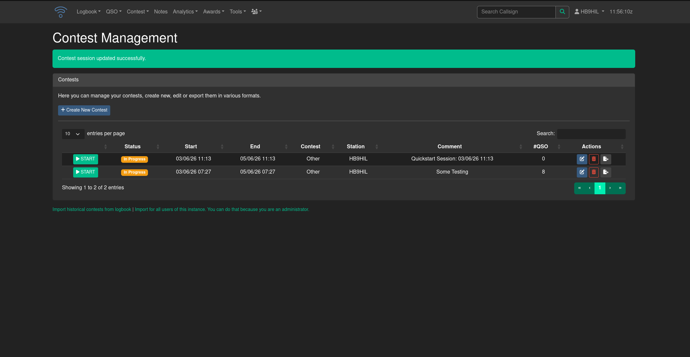
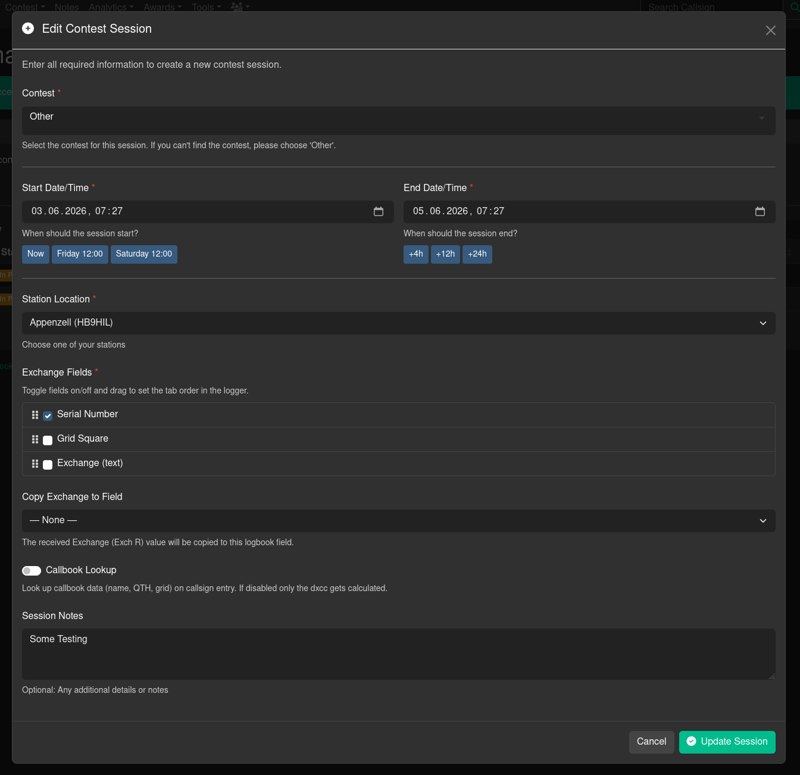

# Management of Contests

The contest manager is available over the main menu under "Contesting" > "Manage Contests". It is the central place to manage all your contests, whether they are upcoming, ongoing or already finished. You can create new contests, edit/export existing ones and view the details of each contest.

## Contest List

The contest list shows all sessions that belong to you (or your club station). Each row displays:

| Column | Description |
|--------|-------------|
| Status | Current state of the session — see below |
| Start / End | The configured date and time window |
| Contest | The contest name (e.g. "CQWW SSB") |
| Station | The station location used for this session |
| Comment | Your session notes |
| #QSO | Number of QSOs logged so far |
| Actions | Edit, delete and export buttons |

### Session Status

Every session is assigned one of three status badges based on the current time:

- **Coming Up** — the start time is in the future
- **In Progress** — now is between start and end time
- **Completed** — the end time has passed

## Starting a Session

Click the green **START** button on the left side of any row to open the Contest Logging Engine for that session. The button is always available regardless of the session status, so you can review or add QSOs to finished sessions as well.

## Creating a New Session

Click **Create New Contest** to open the session setup dialog. Creating sessions in Clubstations requires club officer access (level 9).

### Contest

Select the contest from the dropdown. The list is managed by your administrator in the Contest Administration. If you cannot find your specific contest, choose **Other**.

### Start and End Date/Time

All times are entered and stored in **UTC**. Use the preset buttons to quickly fill in common values:

- **Now** — sets the start time to the current UTC time
- **Friday 12:00** / **Saturday 12:00** — jumps to the next occurrence of that weekday at 12:00 UTC (useful for weekend contests)
- **+4h / +12h / +24h** — sets the end time relative to the start time

### Station Location

Choose which of your configured station profiles is used for this session. The active station from your session is pre-selected.

### Exchange Fields

Select which exchange fields appear in the logging engine and define their tab order. Three field types are available:

| Field | Description |
|-------|-------------|
| **Serial Number** | A sequential QSO number, auto-incremented by the logger |
| **Grid Square** | The Maidenhead locator received from the other station |
| **Exchange (text)** | A free-text exchange field (report, section, club, etc.) |

Toggle each field on or off with the checkbox. Drag the rows using the grip icon to set the order in which the fields are focused when you press Tab in the logger. At least one field must be active.

### Copy Exchange to Field

Optionally map the received Exchange (text) value to a standard logbook field. This allows contest exchanges like a DOK number or a QTH to appear in the correct ADIF field in your regular logbook.

Available targets: DOK, Gridsquare, QTH, Name, Age, State, RX Power (W).

### Callbook Lookup

When enabled, the logger performs a callbook lookup as you type a callsign and pre-fills name, QTH, and grid square. When disabled, only the DXCC entity is calculated locally — useful if you want faster input and do not need additional station details.

### Session Notes

A free-text comment shown in the contest list. Use it to note the band, your setup, the club callsign used, or anything else relevant.

## Editing a Session

Click the pencil icon in the Actions column to re-open the session dialog with the current values pre-filled. All fields can be changed, including the exchange fields and the contest type. Changes take effect immediately.

!!! warning
    Changing the exchange fields of a session that already has QSOs logged does not retroactively alter the existing QSO data.

## Deleting a Session

Click the trash icon to delete a session. A confirmation dialog is shown before anything is removed. Deleting a session removes the session record and if the checkbox for this is enabled, **all QSOs** that were logged in it from both the contest module and the main logbook. Removing the QSOs is optional because you may want to keep the QSOs in your main logbook even if the session itself is deleted.

## Exporting a Session

Click the export icon in the Actions column to open the export page for a session. Exporting requires club access level 6. Two export formats are available: CBR and ADIF.

### ADIF Export

Downloads all QSOs of the session as a standard `.adi` file. All contest exchange fields (serial numbers, text exchanges, grid squares) are included in the corresponding ADIF fields. The filename is generated automatically from the station callsign, contest name, and date.

### Cabrillo Export

Generates a `.cbr` file in the Cabrillo 3.0 format accepted by most contest sponsors. Before downloading, fill in the required category fields. The settings are saved automatically when you download, so re-opening the export page shows your previous choices.
