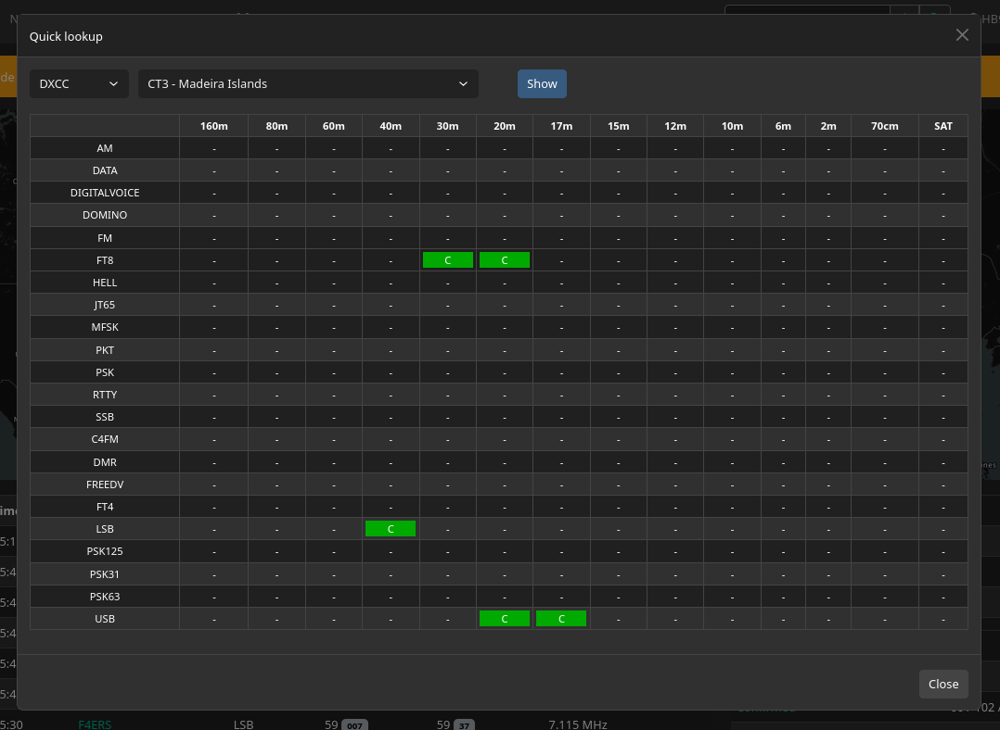
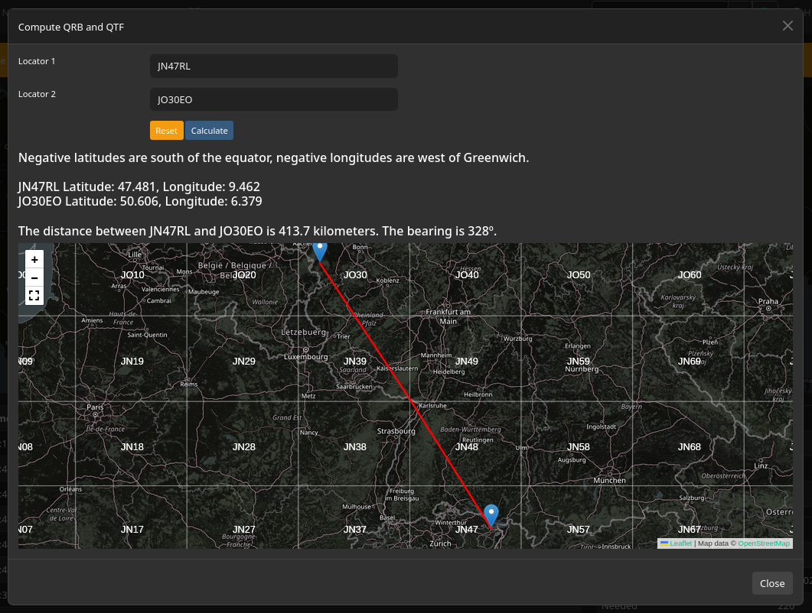

# Global Keyboard Shortcuts

## `Ctrl + L` - Quick Lookup

The Quick Lookup dialog allows you to quickly find and view details for a callsign, gridsquare, DXCC entity or satellite. It can be opened from any page using the `Ctrl + L` keyboard shortcut.

## `Ctrl + Q` - QRB Calculator

The QRB Calculator dialog allows you to calculate the distance and bearing between two gridsquares. It can be opened from any page using the `Ctrl + Q` keyboard shortcut.

