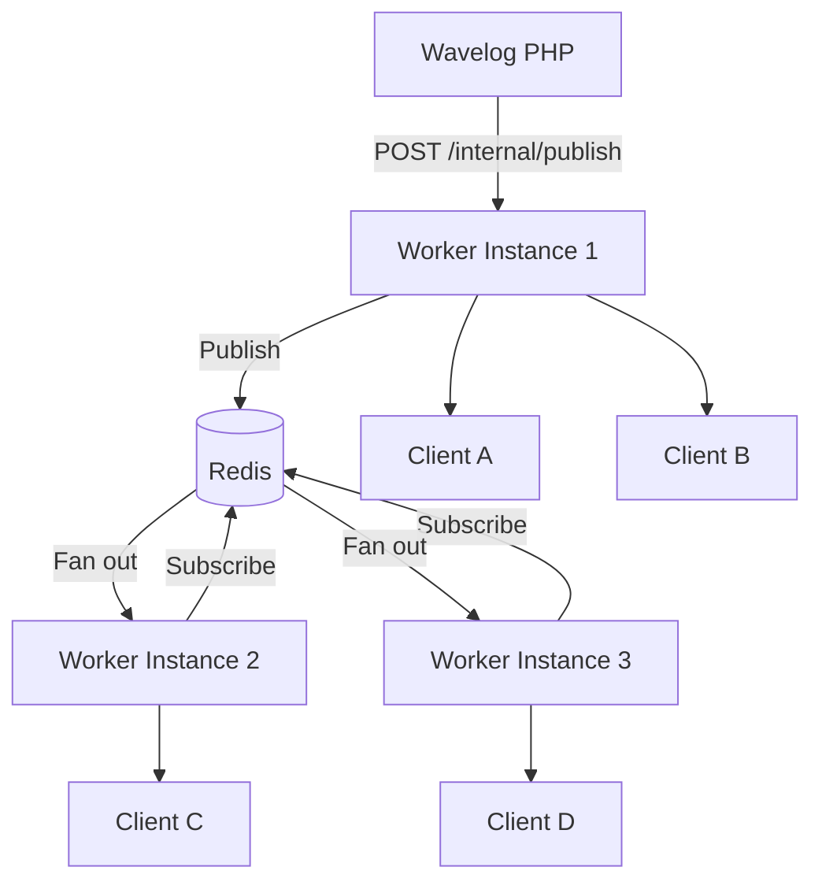

# Clustering

By default, a single Worker instance holds all connected WebSocket clients in memory. This is sufficient for most setups. If you need **high availability** or want to spread load across multiple servers, you can run several Worker instances connected through a **Redis Pub/Sub** channel.

## When Do You Need Clustering?

| Situation | Solution |
|---|---|
| Single server, moderate load | Single instance (default) |
| High availability / zero-downtime restarts | 2+ instances + Redis |
| Very large contest with many operators | 2+ instances + Redis + load balancer |

For a typical club station or even a large multi-op contest, a single Worker instance on a modest VPS handles hundreds of concurrent WebSocket connections without issue.

## How Cluster Mode Works

When `redis_url` is configured, each Worker instance:

1. **Publishes** broadcast events to a shared Redis Pub/Sub channel (`wavelog:events`)
2. **Subscribes** to that channel and forwards incoming events to its local clients
3. **Stores** topic registrations in Redis (with a 24-hour TTL) so all nodes share the same registry

This means a publish arriving at **any** node is instantly forwarded to clients on **all** nodes — regardless of which instance they connected to.



Each instance also delivers events to its **own** local clients directly, without waiting for the Redis round-trip.

## Setup

### 1. Redis

You need a Redis instance reachable by all Worker instances. A minimal Redis setup with Docker:

```bash
docker run -d \
  --name redis \
  --restart unless-stopped \
  -p 6379:6379 \
  redis:7-alpine redis-server --save ""
```

Alternatively, use a managed Redis service (Upstash, Redis Cloud, etc.).

### 2. Worker Configuration

Add `redis_url` to each Worker's `config.yaml`:

```yaml
ws_port: 9000
internal_port: 9001
worker_secret: "your-secret-here-minimum-32-characters"

redis_url: "redis://localhost:6379/2"
```

Use a **dedicated Redis database** (e.g. `/2`) to avoid key collisions with other applications sharing the same Redis instance.

### 3. Load Balancer

Route incoming WebSocket connections across your Worker instances. The key requirement is **sticky sessions** (also called session affinity) — a browser's WebSocket upgrade and all subsequent frames must reach the **same** Worker instance. Standard WebSocket load balancing with any reverse proxy handles this automatically once the connection is established, but ensure your health check is pointed at `/internal/status`.

#### Example: Nginx upstream

```nginx
upstream wavelog_worker {
    least_conn;
    server worker1.internal:9000;
    server worker2.internal:9000;
    server worker3.internal:9000;
}

server {
    listen 443 ssl;
    # ... TLS config ...

    location /worker/ {
        proxy_pass http://wavelog_worker/;
        proxy_http_version 1.1;
        proxy_set_header Upgrade $http_upgrade;
        proxy_set_header Connection "upgrade";
        proxy_set_header Host $host;
        proxy_read_timeout 3600s;
    }
}
```

#### Docker Compose (multi-instance)

```yaml
services:
  redis:
    image: redis:7-alpine
    command: redis-server --save ""
    restart: unless-stopped

  wavelog-worker-1:
    image: ghcr.io/wavelog/wavelog_worker:latest
    restart: unless-stopped
    ports:
      - "9000:9000"
    volumes:
      - ./worker/config.yaml:/app/config.yaml:ro

  wavelog-worker-2:
    image: ghcr.io/wavelog/wavelog_worker:latest
    restart: unless-stopped
    ports:
      - "9002:9000"
    volumes:
      - ./worker/config.yaml:/app/config.yaml:ro
```

With `redis_url: "redis://redis:6379/2"` in `config.yaml`, both instances share state through the Redis container.

## Verifying Cluster Mode

The `/internal/status` endpoint reports the number of active cluster nodes:

```bash
curl -s -H "X-Worker-Secret: your-secret" http://localhost:9001/internal/status
```

```json
{
  "status": "ok",
  "cluster_nodes": 3,
  ...
}
```

`cluster_nodes` equals the number of Worker instances currently subscribed to the Redis Pub/Sub channel. A value of `-1` means single-instance mode (no Redis configured).

## Fallback Behaviour

If Redis is configured but **unavailable** at startup, the Worker logs a warning and falls back to single-instance mode automatically:

```text
cluster: redis unavailable, falling back to single-instance: dial tcp ...
```

The Worker still starts and serves WebSocket connections — it simply cannot synchronise events across other instances until Redis becomes available again (which requires a restart).

## Topic Registry and Restarts

In single-instance mode, topic registrations are held in memory and lost on restart. Wavelog detects this via a `404` response from `/internal/publish` and re-registers the topic transparently.

In cluster mode, topic registrations are stored in Redis and **survive** individual instance restarts. Topics expire automatically after **24 hours** and are refreshed whenever Wavelog re-registers them (e.g. on page reload or contest start).
