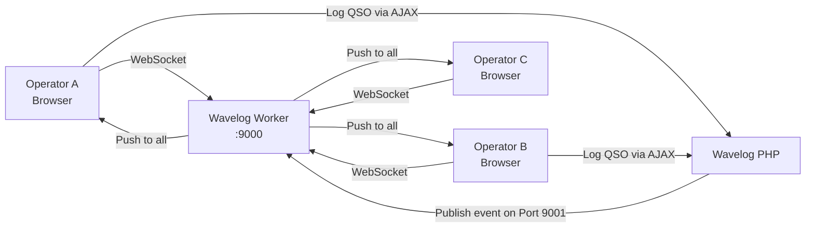
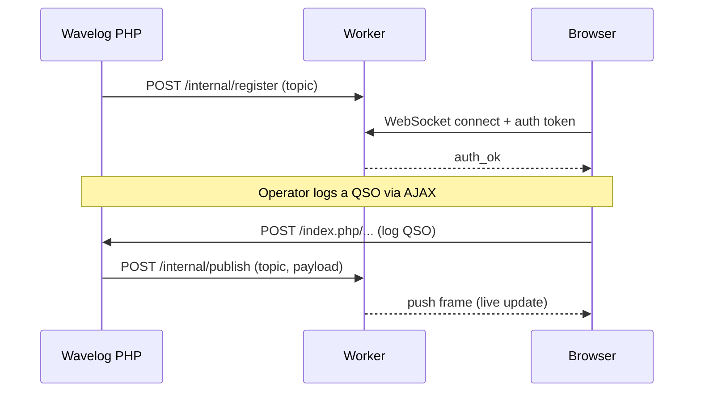

# Wavelog Worker

Repository: [wavelog/wavelog_worker on GitHub](https://github.com/wavelog/wavelog_worker)

!!! note "Still under development"
    The Wavelog Worker is in early beta. The API and configuration may change without warning. Don't use it in production yet. Feedback and testing are welcome!

    Source: [wavelog/wavelog_worker](https://github.com/wavelog/wavelog_worker) on GitHub

The **Wavelog Worker** is an optional add-on service that brings real-time WebSocket connectivity to some live features in Wavelog. It acts as a lightweight gateway between browsers and Wavelog's PHP backend, enabling instant live updates for multi-operator stations. This is necessary for any setup where more than a few operators are accessing live features in Wavelog at the same time. The Worker is designed to be simple to deploy (via Docker) and easy to integrate with Wavelog's existing architecture. It can also be scaled horizontally with Redis for larger setups. Whether you're running a small club station or a large multi-op contest, the Wavelog Worker ensures that all operators stay in sync with real-time updates — without expensive polling or oversized infrastructure.

The Wavelog Worker was originally developed for the new contesting mode in Wavelog, but it can be used for any feature that benefits from real-time push updates.

## What Does It Do?

The Worker listens for broadcast events from Wavelog's PHP backend (e.g. when a QSO is logged) and pushes those updates to all connected browsers in real time via WebSockets. This allows multiple operators to see live updates without refreshing the page or waiting for AJAX polling intervals.

## Do You Need It?

The Worker is **optional**. Your Wavelog installation continues to work without it.

| Scenario | Worker needed? |
|---|---|
| Single operator, personal station | No |
| Shared hosting without Docker | No |
| Club station with a few simultaneous users (2–3) | No |
| Many simultaneous users (10+) on any live feature | **Yes** |
| Large multi-op contest or busy club station | **Yes** |

The Worker is designed for setups where 10–20+ users are accessing Wavelog at the same time. In these scenarios, high-frequency AJAX polling can cause performance issues. The Worker provides a WebSocket push mechanism — something PHP alone cannot implement — and delivers updates to all connected browsers in real time. If you have a small station with only a few users, you can get by without the Worker just fine. But if you're running a busy club station, a large multi-op contest, or any feature with many simultaneous users, the Worker is highly recommended to ensure smooth performance and real-time updates.

## How It Works

The Worker is **push-only**. Operators still send their log entries directly to Wavelog's PHP backend via AJAX — the Worker does not proxy or intercept those requests. Its only job is to receive broadcast events and data from PHP and forward them instantly to all connected browsers on the same topic.

## Requirements

- Docker (or the ability to run a compiled binary)
- Network access between Wavelog's web server and the Worker's internal port (9001) - NEVER expose the Worker's internal port to the public internet!
- Network access from browsers to the Worker's WebSocket port (9000)
- A shared secret of at least 32 characters

## Next Steps

- [Install the Worker](installation.md) — deploy via Docker in minutes
- [Connect Wavelog](wavelog-integration.md) — point Wavelog at your Worker
- [Configure the Worker](configuration.md) — all config options explained
- [Scale with Redis](clustering.md) — run multiple Worker instances behind a load balancer
