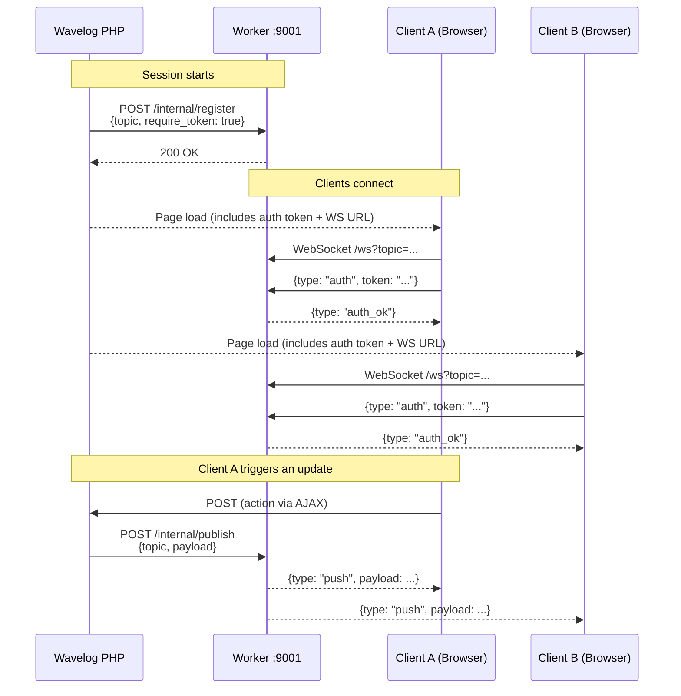

# Wavelog Integration

Once the Worker is running, you need to tell Wavelog where to find it. This page covers the Wavelog-side configuration.

## Prerequisites

- The Worker is running and reachable (see [Installation](installation.md))
- You have the `worker_secret` value you set in the Worker's `config.yaml`
- You know the Worker's internal API URL (e.g. `http://localhost:9001` or `http://wavelog-worker:9001`)
- You know the Worker's public WebSocket URL (e.g. `wss://your-domain.example/worker`)

## Wavelog Configuration

Create a new file `config/worker.php` based on `config/worker.sample.php` and fill in the required values:

```php
<?php

/*
| -------------------------------------------------------------------------
| Wavelog Worker Configuration
| -------------------------------------------------------------------------
|
| Optional WebSocket gateway for real-time updates in the browser. Requires
| the separate wavelog_worker service. Set worker_enabled = true to activate.
| Wavelog falls back to the classic AJAX heartbeat when disabled.
|
*/

// Enable or disable the Worker integration entirely.
$config['worker_enabled'] = true;

// Optional VIP/load-balancer URL shown as a connectivity check in the debug page.
// Leave empty for single-instance setups.
$config['worker_vip'] = '';

// Internal URLs of wavelog_worker instances (PHP -> Worker, HTTP).
// Single instance: one entry. Cluster: one entry per node.
// PHP publishes to the first entry; the debug page shows status of all nodes.
// Keep in Mind: If you enter more than one worker url, it means you run a cluster. In this case you need 
// a Redis / Valkey instance. More info you can find in the wavelog_worker sample config.yaml.
$config['worker_urls'] = [
    'http://127.0.0.1:9001',
];

// Shared secret — must match worker_secret in the worker's config.yaml.
// Generate with: openssl rand -hex 32
$config['worker_secret'] = '';

// Timeout for publish calls in seconds (float). Keep it short:
// a slow worker must not block QSO saves.
$config['worker_timeout'] = 1.0;

// Public WebSocket URL for the browser (Browser -> Worker).
// May differ from worker_url when behind a reverse proxy or in Docker.
// Format: ws://host:port or wss://host:port. Empty = no WebSocket in browser.
$config['worker_client_url'] = 'ws://log.example.org:9000';

```

!!! tip "Docker setups"
    If Wavelog and the Worker run in the same Docker Compose stack, use the
    service name as the hostname:

    ```php
    $config['worker_url'] = 'http://wavelog-worker:9001';
    ```

## How the Integration Works

The following diagram shows the full lifecycle of a real-time session (e.g. a contest, a live dashboard, or any feature using the Worker):



### Topics

Each session gets its own **topic** — an opaque string identifier used to group connected browsers. Wavelog creates the topic when a feature is activated and registers it with the Worker. Other clients joining the same session receive the same topic and auth token on their page load.

### Authentication

When the Worker topic is registered with `require_token: true`, every browser must present a valid **HMAC token** as the first WebSocket frame. This token is generated by PHP using the shared secret, includes an expiry timestamp, and is embedded in the page when it loads.

The token is short-lived by design: if it expires while the connection is open, the next AJAX heartbeat will return a 401, and the Worker closes the connection with an `auth_expired` error. The page then reloads and obtains a fresh token automatically.

### Internal API Endpoints

These endpoints are used exclusively by Wavelog's PHP backend. They are **not** meant to be called manually during normal operation.

All requests must include the `X-Worker-Secret` header.

#### `POST /internal/register`

Registers a topic before any browser can connect to it.

```json
{
  "topic": "session:abc123",
  "meta": {
    "require_token": true
  }
}
```

#### `POST /internal/unregister`

Removes a topic when the session ends.

```json
{
  "topic": "session:abc123"
}
```

#### `POST /internal/publish`

Broadcasts a payload to all browsers subscribed to a topic.

```json
{
  "topic": "session:abc123",
  "payload": { ... }
}
```

Returns `404` if the topic is not registered. Wavelog handles this by re-registering and retrying.

#### `GET /internal/status`

Returns a JSON status object with uptime, connected client count, and registered topics. Useful for monitoring.

```bash
curl -s -H "X-Worker-Secret: your-secret" http://localhost:9001/internal/status
```

```json
{
  "status": "ok",
  "version": "1.0.0",
  "uptime": "14m22s",
  "registered_topics": 2,
  "active_topics": 2,
  "connected_clients": 5,
  "topic_list": ["session:abc123", "session:def456"],
  "cluster_nodes": -1
}
```

## Troubleshooting

### Browsers cannot connect / WebSocket fails

- Check that the WebSocket URL (`worker_ws_url`) is correct and uses `wss://` for HTTPS sites.
- Verify your reverse proxy passes `Upgrade: websocket` headers (see [Installation → Reverse Proxy](installation.md#reverse-proxy-https-wss)).

### PHP cannot reach the internal API

- Check that `worker_url` points to port 9001, not 9000.
- Verify firewall or Docker network rules allow PHP → Worker on port 9001.

### `topic not registered` (HTTP 404 from `/internal/publish`)

- The Worker may have restarted and lost its in-memory registry. Wavelog handles this automatically: it catches the 404, re-registers the topic, and retries the publish.
- In Redis cluster mode, topics are stored in Redis and survive restarts.

### `auth_expired` WebSocket error

- The browser's auth token expired. The page will reload automatically and obtain a fresh token. This is expected behaviour after long idle periods.
